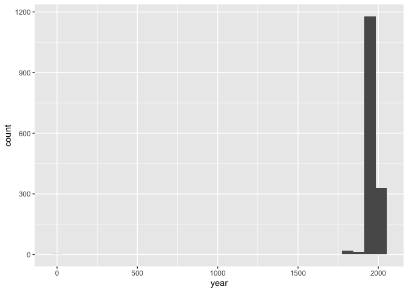
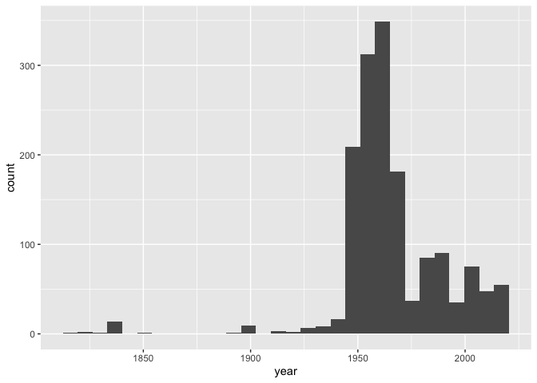
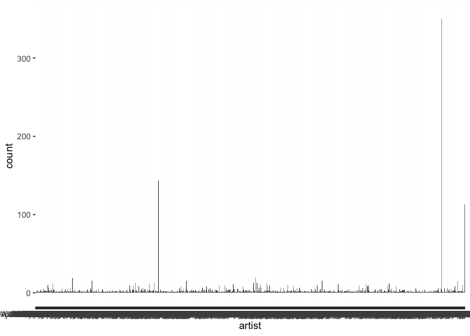

Lab 07 - University of Edinburgh Art Collection
================
Elayna Seago
3/8/22

### Load packages and data

``` r
library(tidyverse) 
library(skimr)
library(stringr)
```

``` r
# Remove eval = FALSE or set it to TRUE once data is ready to be loaded
uoe_art <- read_csv("data/uoe-art.csv")
```

### Exercise 10

There were 3 warnings: 1) that additional info was discarded, 2) that
missing info was filled with “NA”, and 3) that NAs were introduced in a
numeric variable. We are okay with all of these errors because 1) we
only want year data so extra date info can be discarded, 2) if the year
is not present, we should denote it as being NA, 3) we know NA is not a
number

``` r
uoe_art <- uoe_art %>%
  separate(title, into = c("title", "date"), sep = "\\(") %>%
  mutate(year = str_remove(date, "\\)") %>% as.numeric()) %>%
  select(title, artist, year, date)
```

    ## Warning: Expected 2 pieces. Additional pieces discarded in 38 rows [164, 237,
    ## 399, 418, 442, 536, 561, 578, 588, 605, 937, 1073, 1105, 1122, 1261, 1352, 1397,
    ## 1404, 1426, 1548, ...].

    ## Warning: Expected 2 pieces. Missing pieces filled with `NA` in 620 rows [1,
    ## 12, 23, 32, 36, 51, 60, 68, 70, 79, 80, 85, 91, 93, 97, 101, 104, 109, 114,
    ## 118, ...].

    ## Warning in str_remove(date, "\\)") %>% as.numeric(): NAs introduced by coercion

### Exercise 11

###artist info missing = 113 ###year info missing = 1369

``` r
skim(uoe_art)
```

|                                                  |         |
|:-------------------------------------------------|:--------|
| Name                                             | uoe_art |
| Number of rows                                   | 2910    |
| Number of columns                                | 4       |
| \_\_\_\_\_\_\_\_\_\_\_\_\_\_\_\_\_\_\_\_\_\_\_   |         |
| Column type frequency:                           |         |
| character                                        | 3       |
| numeric                                          | 1       |
| \_\_\_\_\_\_\_\_\_\_\_\_\_\_\_\_\_\_\_\_\_\_\_\_ |         |
| Group variables                                  | None    |

Data summary

**Variable type: character**

| skim_variable | n_missing | complete_rate | min | max | empty | n_unique | whitespace |
|:--------------|----------:|--------------:|----:|----:|------:|---------:|-----------:|
| title         |         1 |          1.00 |   0 |  95 |     8 |     1340 |          0 |
| artist        |       113 |          0.96 |   2 |  55 |     0 |     1099 |          0 |
| date          |       621 |          0.79 |   3 |  49 |     0 |      374 |          0 |

**Variable type: numeric**

| skim_variable | n_missing | complete_rate |   mean |    sd |  p0 |  p25 |  p50 |  p75 | p100 | hist  |
|:--------------|----------:|--------------:|-------:|------:|----:|-----:|-----:|-----:|-----:|:------|
| year          |      1369 |          0.53 | 1964.5 | 55.98 |   2 | 1953 | 1962 | 1980 | 2020 | ▁▁▁▁▇ |

### Exercise 12

### yes, I see something out of the ordinary. One piece has a date of \~zero

``` r
uoe_art %>% 
  ggplot(aes(x = year))+
  geom_histogram()
```

    ## `stat_bin()` using `bins = 30`. Pick better value with `binwidth`.

    ## Warning: Removed 1369 rows containing non-finite values (stat_bin).

<!-- -->

``` r
  #coord_cartesian(xlim = c(1750 , 2022))
```

### Exercise 13

###death mask is dated as year 2, however, it should be 1964. There are
two numbers in parentheses, the first of which is (2)

``` r
uoe_art %>% 
  arrange(year)
```

    ## # A tibble: 2,910 × 4
    ##    title                                      artist         year date   
    ##    <chr>                                      <chr>         <dbl> <chr>  
    ##  1 "Death Mask "                              H. Dempshall      2 "2) "  
    ##  2 "Sampler. Mary Ann Park "                  Mary Ann Park  1819 "1819)"
    ##  3 "Fine lawn collar "                        Unknown        1820 "1820)"
    ##  4 "Dying Gaul "                              Unknown        1822 "1822)"
    ##  5 "The Dead Christ "                         Unknown        1831 "1831)"
    ##  6 "Crouching Venus "                         Sarti          1834 "1834)"
    ##  7 "Gates of Paradise "                       Clement Pappi  1835 "1835)"
    ##  8 "Castor and Pollux "                       Sarti          1835 "1835)"
    ##  9 "Metope 11, south entablature, Parthenon " <NA>           1837 "1837)"
    ## 10 "Metope 5, south entablature, Parthenon "  <NA>           1837 "1837)"
    ## # … with 2,900 more rows

### Exercise 13b

``` r
uoe_art_edit <- uoe_art %>% 
  mutate(
    year = if_else(
      year == "2" , "1964" ,
      if_else(year != "2" , paste0(year), "NA"
    ))) %>% 
  mutate(year = as.numeric(year))
```

``` r
uoe_art_edit %>% 
  arrange(year)
```

    ## # A tibble: 2,910 × 4
    ##    title                                      artist         year date 
    ##    <chr>                                      <chr>         <dbl> <chr>
    ##  1 "Sampler. Mary Ann Park "                  Mary Ann Park  1819 1819)
    ##  2 "Fine lawn collar "                        Unknown        1820 1820)
    ##  3 "Dying Gaul "                              Unknown        1822 1822)
    ##  4 "The Dead Christ "                         Unknown        1831 1831)
    ##  5 "Crouching Venus "                         Sarti          1834 1834)
    ##  6 "Gates of Paradise "                       Clement Pappi  1835 1835)
    ##  7 "Castor and Pollux "                       Sarti          1835 1835)
    ##  8 "Metope 11, south entablature, Parthenon " <NA>           1837 1837)
    ##  9 "Metope 5, south entablature, Parthenon "  <NA>           1837 1837)
    ## 10 "Metope South 7 from the Parthenon "       <NA>           1837 1837)
    ## # … with 2,900 more rows

``` r
uoe_art_edit %>% 
  ggplot(aes(x = year))+
  geom_histogram()
```

    ## `stat_bin()` using `bins = 30`. Pick better value with `binwidth`.

    ## Warning: Removed 1369 rows containing non-finite values (stat_bin).

<!-- -->

``` r
  #coord_cartesian(xlim = c(1750 , 2022))
```

### Exercise 14

The most prolific artist is “unknown.” (jk). The author with the most
pieces is Emma Gillies. I do not know of her, but I looked her up and
she is a Scottish potter who lived near Edinburgh, so proximity may
explain why they have so much of her work.

``` r
uoe_art_edit %>% 
  ggplot(aes(x = artist))+
  geom_bar()
```

<!-- -->

``` r
uoe_art_edit %>% 
  count(artist) %>% 
  arrange(desc(n))
```

    ## # A tibble: 1,100 × 2
    ##    artist               n
    ##    <chr>            <int>
    ##  1 Unknown            350
    ##  2 Emma Gillies       143
    ##  3 <NA>               113
    ##  4 John Bellany        20
    ##  5 Ann F Ward          19
    ##  6 Zygmunt Bukowski    17
    ##  7 Boris Bućan         16
    ##  8 Gordon Bryce        16
    ##  9 Marjorie Wallace    16
    ## 10 William Gillon      15
    ## # … with 1,090 more rows

### Exercise 15

### 10 pieces have the word child in their title

``` r
uoe_art_edit %>% 
  filter(
    str_detect(title , "child") |
      str_detect(title , "Child")
  )
```

    ## # A tibble: 10 × 4
    ##    title                                 artist            year date            
    ##    <chr>                                 <chr>            <dbl> <chr>           
    ##  1 "Child's collar. Chinese"             Unknown             NA <NA>            
    ##  2 "Virgin and Child "                   Unknown             NA statuette head …
    ##  3 "The Children's Hour "                Eduardo Luigi P…    NA 1974-1976)      
    ##  4 "Untitled - Children Playing "        Monika L I Ueck…  1963 1963)           
    ##  5 "Virgin and Child"                    Unknown             NA <NA>            
    ##  6 "Woman with Child and Still Life "    Catherine I. Mc…  1938 1938)           
    ##  7 "Child's chinese headdress"           Unknown             NA <NA>            
    ##  8 "Virgin and Child "                   Unknown             NA Tondo)          
    ##  9 "Figure Composition with Nurse and C… Edward A. Gage      NA Circa 1950)     
    ## 10 "The Sun Dissolves while Man Looks A… Eduardo Luigi P…    NA <NA>
